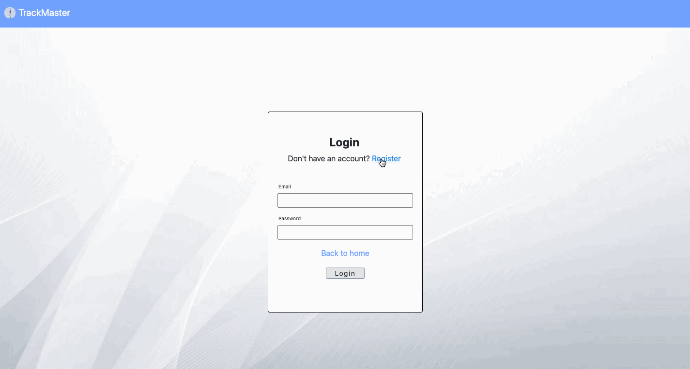
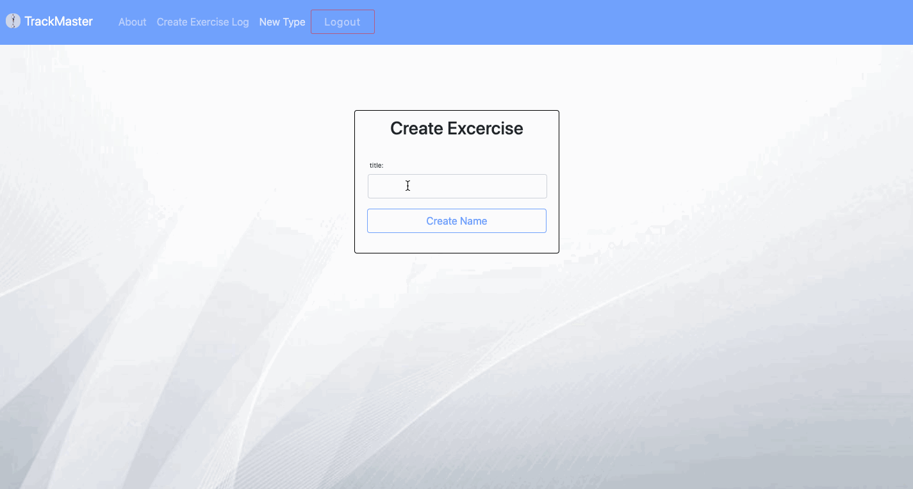
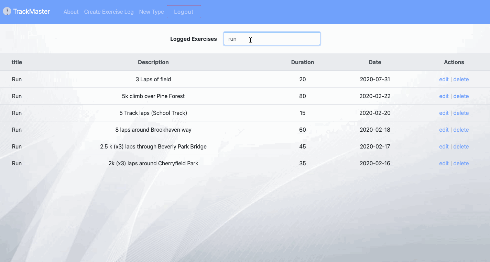

# Description

This is a MERN stack application. It is a project which was carried out as a 4th & final year project for the Advanced JavaScript module in the Creative Computing course at IADT Dun Laoighre. This folder contains the complete files of the MERN stack application.

The goal for this application was to provide a web application "TrackMaster" which allows users to log exercises through a personalised experience.

The application will allow users to register an account & login. Users will also be able to view all exercises from the database, create new exercise types & logs, edit & delete their exercises (CRUD functionality), search for a particular exercise type & also add images of places they had visited during certain exercises (for example: runs/hikes through the wicklow mountains).

# Getting Started

To run this project locally, Clone (or download) the repository:

git clone https://github.com/chriskeaveney/TrackMaster.git

Then Enter the folder: cd TrackMaster

Then run the following commands:

npm install (in both the root directory & client directory) - This installs any dependencies needed to run the project

npm run dev - This concurrently runs the applications backend & development server . Open http://localhost:3000 to view it in the browser.

